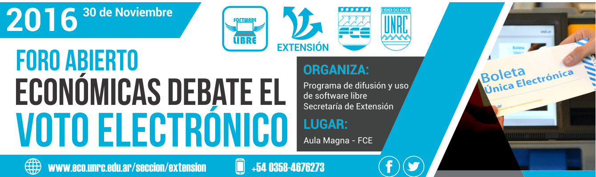
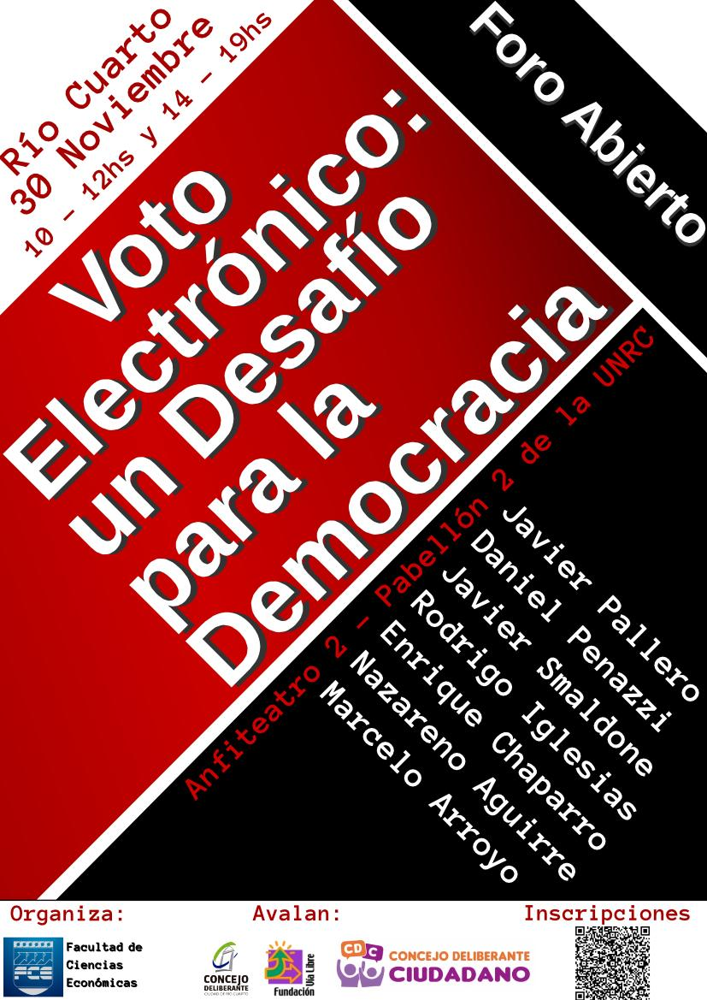

### Presentación del Foro por Fede Heinz

[Video](http://tiny.cc/ut1dhy)

<iframe width="420" height="315" src="https://photos.google.com/share/AF1QipOC_Vlm-dYU7m0QLSD9NSNpL1RbAk6b57ZQL131RyGcqy-HjqxdhJbKq8S8Ay46rA?key=V2JWVGVseThoRndjanYyLVBvenJiUDUxbU1lZy1R" frameborder="0" allowfullscreen></iframe>

### Panel de especialistas

> **Javier Smaldone** (informático, especialista en voto electrónico).  
> **Daniel Penazzi** (matemático, especialista en criptografía).  
> **Javier Pallero** (analista de políticas TIC para América Latina en Access Now)  
> **Rodrigo Iglesias** (abogado técnico e investigador de la UBA sobre las implicancias de utilizar Voto Electrónico)  
> **Marcelo Arroyo** (docente dpto Computación, UNRC)  
> **Nazareno Aguirre** (Dir. dpto Computación, UNRC)

### 30 de Nov. 2016 10hs, Aula Magna de la Fac. de Ciencias Económicas UNRC.

### Organiza

Programa de difusión y uso del Software Libre  
Secretaría de Extensión y Asistencia Técnica  
Facultad de Ciencias Económicas  
UNIVERSIDAD NACIONAL DE RÍO CUARTO.

### Invitan
[Fundación Vía Libre](http://www.vialibre.org.ar)

