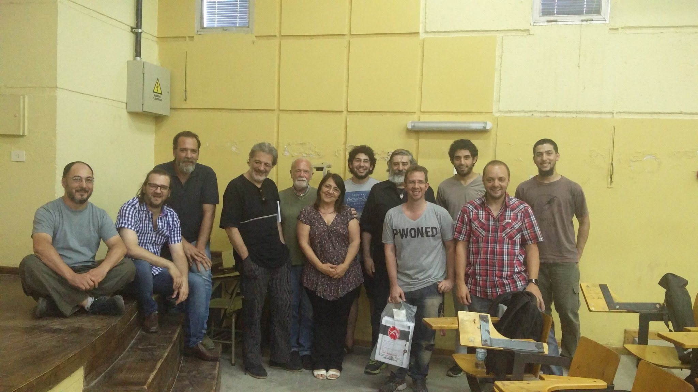

### Presentación del Foro por Fede Heinz

[Video](https://goo.gl/photos/e9RLxtwLwkQu3qPf7)

### Panel de especialistas

> **Javier Smaldone** (informático, especialista en voto electrónico).  
> **Daniel Penazzi** (matemático, especialista en criptografía).  
> **Javier Pallero** (analista de políticas TIC para América Latina en Access Now)  
> **Rodrigo Iglesias** (abogado técnico e investigador de la UBA sobre las implicancias de utilizar Voto Electrónico)  
> **Marcelo Arroyo** (docente dpto Computación, UNRC)  
> **Nazareno Aguirre** (Dir. dpto Computación, UNRC)
> **Enrique Chaparro** (matemático, especialista en Seguridad Informática)

### Cobertura periodística en la UNRC

UniRioTV, Pantalla libre
<iframe width="420" height="315" src="http://www.youtube.com/embed/OhYTRBVWfiE" frameborder="0" allowfullscreen></iframe>

<iframe width="420" height="315" src="http://www.youtube.com/embed/6ItmBiltW9M" frameborder="0" allowfullscreen></iframe>

[El especialista Javier Smaldone participó del Foro Abierto “Voto electrónico, un desafío para la democracia”](https://www.unrc.edu.ar/unrc/n_comp.cdc?nota=30231)

### Organiza

Programa de difusión y uso del Software Libre  
Secretaría de Extensión y Asistencia Técnica  
Facultad de Ciencias Económicas  
UNIVERSIDAD NACIONAL DE RÍO CUARTO.

### Invitan
[Fundación Vía Libre](http://www.vialibre.org.ar)

### Foto grupal

