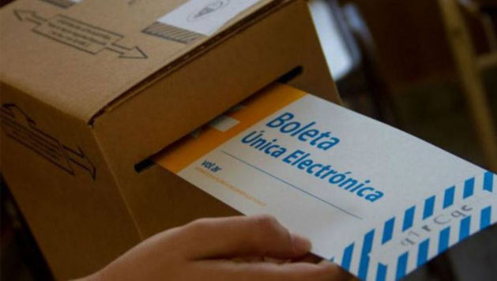

### Expositores

> **Javier Smaldone** (informático, especialista en voto electrónico).  
> **Daniel Penazzi** (matemático, especialista en criptografía).  
> **Javier Pallero** (analista de políticas TIC para América Latina en Access Now)  
> **Rodrigo Iglesias** (abogado técnico e investigador de la UBA sobre las implicancias de utilizar Voto Electrónico)  

### 30 de Nov. 2016 14hs, Aula Magna de la Fac. de Ciencias Económicas UNRC.

### Organiza

Programa de difusión y uso del Software Libre  
Secretaría de Extensión y Asistencia Técnica  
Facultad de Ciencias Económicas  
UNIVERSIDAD NACIONAL DE RÍO CUARTO.

### Invitan
Fundación Vía Libre

### Adhieren

